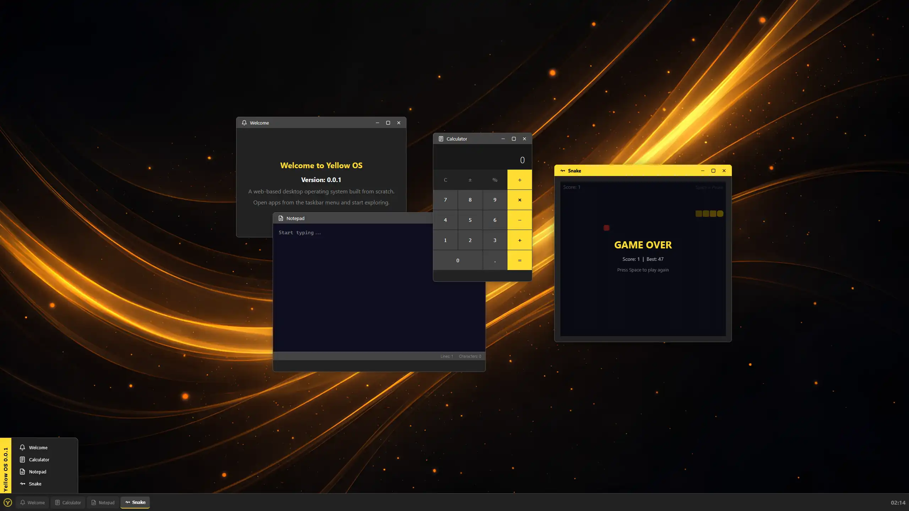

# Yellow OS

## Table of contents

- [**About**](#about)
- [**Features**](#features)
- [**Screenshots**](#screenshots)
- [**Usage**](#usage)
- [**Installation**](#installation)
- [**License**](#license)
- [**Contribution**](#contribution)
- [**Donations**](#donations)
- [**Star history**](#star-history)

## About

Official website: **https://yellow-os.com**

**Yellow OS** is a web operating system written in:

- **Backend:** Bun
- **Frontend:** Svelte

## Features

### System

- **Desktop environment** - window manager with drag, resize and snap zones, taskbar with start menu, virtual desktops, app switcher, context menus, toast notifications, etc.
- **File system** - built on browser's Origin Private File System (OPFS) with file operations, drag & drop upload/download, trash, clipboard, file type associations and conflict resolution
- **UI** - Many reusable UI components

### Applications

- **File Browser**
- **Image Viewer**
- **Text Editor**
- **Calculator**
- **App Player**

### Games

- **Pong**
- **Snake**

## Screenshots

## Usage

- For usage instructions follow [**this document**](./USAGE.md).

## Installation

- For installation instructions follow [**this document**](./INSTALL.md).

## License

- This software is developed under the license called [**Unlicense**](./LICENSE).

## Contribution

If you are interested in contributing to the development of this project, we would love to hear from you! Developers can reach out to us through one of the contact methods listed on [**our contacts page**](https://libersoft.org/contacts). We prefer communication through our Telegram chat group, but feel free to use any method that suits you.
In addition to direct communication, you are welcome to contribute by submitting issues or pull requests on our project repository. Your insights and contributions are valuable to us. We look forward to collaborating with you!

## Donations

Donations are important to support the ongoing development and maintenance of our open source projects. Your contributions help us cover costs and support our team in improving our software. We appreciate any support you can offer.

To find out how to donate our projects, please navigate here:

Thank you for being a part of our projects' success!

## Star history

If you support decentralized technology and open protocols, consider starring this repository. Thank you!

